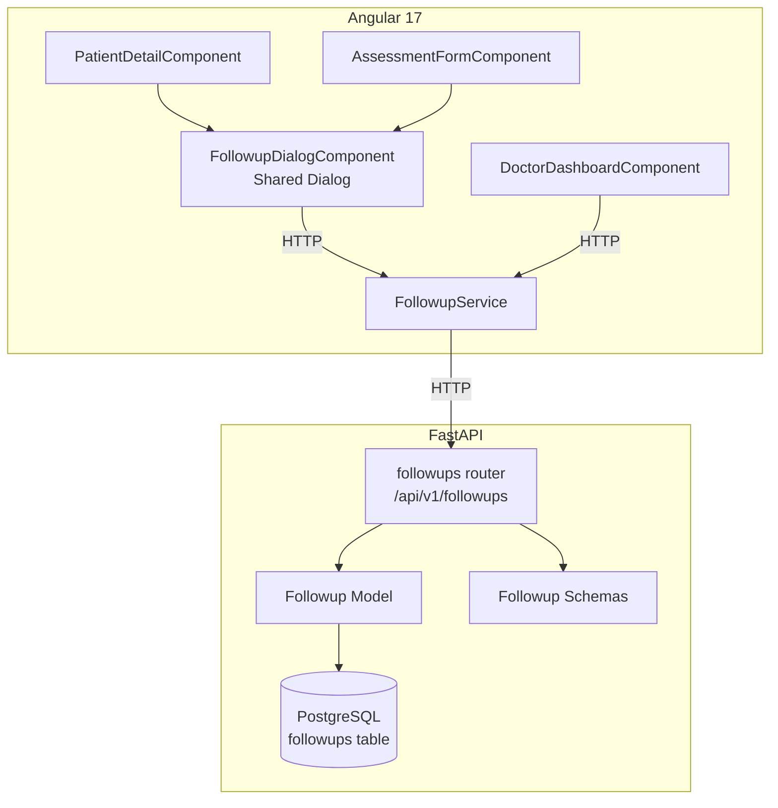
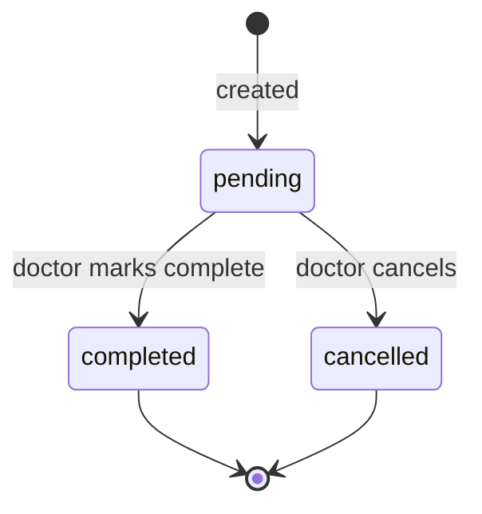

# Design Document: Doctor Follow-Up Scheduling

## Overview

This feature adds a `followups` table and full CRUD API to the MEDRecords backend, plus frontend integration into the assessment form, patient detail page, and doctor dashboard. Doctors can schedule follow-up visits for patients, track their status (pending → completed/cancelled), and see pending/today's follow-ups on their dashboard.

The design follows existing project patterns: SQLAlchemy async model, Pydantic schemas, FastAPI router with `role_required` dependency, and Angular 17 standalone components with PrimeNG.

## Architecture



**Data Flow:**
1. Doctor clicks "Schedule Follow-up" → shared `FollowupDialogComponent` opens
2. Doctor fills date + optional notes → dialog calls `FollowupService.create()`
3. `FollowupService` POSTs to `/api/v1/followups` with JWT auth
4. Router validates payload, creates record, returns 201
5. Dialog closes, parent component refreshes its follow-up data

## Components and Interfaces

### Backend

#### Model: `backend/app/models/followup.py`

```python
from datetime import date, datetime
from typing import Optional

from sqlalchemy import BigInteger, CheckConstraint, Date, DateTime, ForeignKey, Index, String, func
from sqlalchemy.orm import Mapped, mapped_column, relationship

from app.database import Base


class Followup(Base):
    __tablename__ = "followups"

    id: Mapped[int] = mapped_column(BigInteger, primary_key=True, autoincrement=True)
    patient_id: Mapped[int] = mapped_column(
        BigInteger, ForeignKey("patients.id", ondelete="RESTRICT"), nullable=False
    )
    doctor_id: Mapped[int] = mapped_column(
        BigInteger, ForeignKey("users.id", ondelete="RESTRICT"), nullable=False
    )
    assessment_id: Mapped[Optional[int]] = mapped_column(
        BigInteger, ForeignKey("assessments.id", ondelete="RESTRICT"), nullable=True
    )
    scheduled_date: Mapped[date] = mapped_column(Date, nullable=False)
    notes: Mapped[Optional[str]] = mapped_column(String(500), nullable=True)
    status: Mapped[str] = mapped_column(String(20), nullable=False, server_default="pending")
    created_at: Mapped[datetime] = mapped_column(
        DateTime(timezone=True), server_default=func.now(), nullable=False
    )
    updated_at: Mapped[datetime] = mapped_column(
        DateTime(timezone=True), server_default=func.now(), onupdate=func.now(), nullable=False
    )

    # Relationships
    patient: Mapped["Patient"] = relationship("Patient", foreign_keys=[patient_id])
    doctor: Mapped["User"] = relationship("User", foreign_keys=[doctor_id])
    assessment: Mapped[Optional["Assessment"]] = relationship("Assessment", foreign_keys=[assessment_id])

    __table_args__ = (
        CheckConstraint("status IN ('pending', 'completed', 'cancelled')", name="ck_followups_status"),
        Index("idx_followups_patient_id", "patient_id"),
        Index("idx_followups_doctor_id", "doctor_id"),
        Index("idx_followups_status", "status"),
        Index("idx_followups_scheduled_date", "scheduled_date"),
        Index("idx_followups_doctor_status_date", "doctor_id", "status", "scheduled_date"),
    )
```

#### Schemas: `backend/app/schemas/followup.py`

```python
from datetime import date, datetime
from typing import Optional

from pydantic import BaseModel, Field, field_validator


class FollowupCreate(BaseModel):
    patient_id: int
    assessment_id: Optional[int] = None
    scheduled_date: date
    notes: Optional[str] = Field(None, max_length=500)

    @field_validator("scheduled_date")
    @classmethod
    def date_must_be_future(cls, v: date) -> date:
        from datetime import date as date_type
        today = date_type.today()
        delta = (v - today).days
        if delta < 1:
            raise ValueError("scheduled_date must be at least 1 day in the future")
        if delta > 365:
            raise ValueError("scheduled_date must be no more than 365 days from today")
        return v


class FollowupUpdate(BaseModel):
    status: Optional[str] = None
    scheduled_date: Optional[date] = None
    notes: Optional[str] = Field(None, max_length=500)

    @field_validator("status")
    @classmethod
    def status_must_be_valid(cls, v: Optional[str]) -> Optional[str]:
        if v is not None and v not in ("pending", "completed", "cancelled"):
            raise ValueError("status must be one of: pending, completed, cancelled")
        return v

    @field_validator("scheduled_date")
    @classmethod
    def date_must_be_future(cls, v: Optional[date]) -> Optional[date]:
        if v is not None:
            from datetime import date as date_type
            today = date_type.today()
            delta = (v - today).days
            if delta < 1:
                raise ValueError("scheduled_date must be at least 1 day in the future")
            if delta > 365:
                raise ValueError("scheduled_date must be no more than 365 days from today")
        return v


class FollowupResponse(BaseModel):
    id: int
    patient_id: int
    doctor_id: int
    assessment_id: Optional[int] = None
    scheduled_date: date
    notes: Optional[str] = None
    status: str
    created_at: datetime
    updated_at: datetime

    # Denormalized display fields (populated by router)
    patient_name: Optional[str] = None
    patient_uid: Optional[str] = None
    disease_name: Optional[str] = None

    model_config = {"from_attributes": True}
```

#### Router: `backend/app/routers/followups.py`

```python
router = APIRouter(tags=["Follow-ups"])

VALID_TRANSITIONS = {
    "pending": ["completed", "cancelled"],
    "completed": [],
    "cancelled": [],
}

# POST /           → create followup (doctor only)
# GET /            → list followups (paginated, doctor-scoped, filterable by status/patient_id)
# GET /{id}        → get single followup (doctor-scoped)
# PATCH /{id}      → update followup (doctor-scoped, enforces state machine)
# GET /dashboard   → dashboard aggregates (pending count, today's followups)
```

**Key function signatures:**

```python
@router.post("/", response_model=FollowupResponse, status_code=201)
async def create_followup(
    payload: FollowupCreate,
    current_user: User = Depends(role_required(["doctor"])),
    db: AsyncSession = Depends(get_db),
) -> FollowupResponse: ...

@router.get("/", response_model=PaginatedResponse[FollowupResponse])
async def list_followups(
    page: int = Query(1, ge=1),
    page_size: int = Query(20, ge=1, le=100),
    status: Optional[str] = Query(None),
    patient_id: Optional[int] = Query(None),
    current_user: User = Depends(role_required(["doctor"])),
    db: AsyncSession = Depends(get_db),
) -> PaginatedResponse[FollowupResponse]: ...

@router.get("/dashboard", response_model=FollowupDashboard)
async def get_followup_dashboard(
    current_user: User = Depends(role_required(["doctor"])),
    db: AsyncSession = Depends(get_db),
) -> FollowupDashboard: ...

@router.get("/{id}", response_model=FollowupResponse)
async def get_followup(
    id: int,
    current_user: User = Depends(role_required(["doctor"])),
    db: AsyncSession = Depends(get_db),
) -> FollowupResponse: ...

@router.patch("/{id}", response_model=FollowupResponse)
async def update_followup(
    id: int,
    payload: FollowupUpdate,
    current_user: User = Depends(role_required(["doctor"])),
    db: AsyncSession = Depends(get_db),
) -> FollowupResponse: ...
```

**State machine enforcement in `update_followup`:**
```python
if payload.status and payload.status != followup.status:
    allowed = VALID_TRANSITIONS.get(followup.status, [])
    if payload.status not in allowed:
        raise HTTPException(
            status_code=422,
            detail=f"Cannot transition from '{followup.status}' to '{payload.status}'. "
                   f"Allowed transitions: {allowed or 'none'}"
        )
```

**Dashboard schema:**
```python
class FollowupDashboard(BaseModel):
    pending_count: int
    today_followups: list[FollowupResponse]
```

### Frontend

#### Service: `frontend/src/app/core/services/followup.service.ts`

```typescript
@Injectable({ providedIn: 'root' })
export class FollowupService {
  private http = inject(HttpClient);
  private baseUrl = 'http://localhost:8000/api/v1/followups';

  create(payload: FollowupCreatePayload): Observable<Followup> { ... }
  list(params: FollowupListParams): Observable<PaginatedResponse<Followup>> { ... }
  getById(id: number): Observable<Followup> { ... }
  update(id: number, payload: FollowupUpdatePayload): Observable<Followup> { ... }
  getDashboard(): Observable<FollowupDashboard> { ... }
}

export interface Followup {
  id: number;
  patient_id: number;
  doctor_id: number;
  assessment_id: number | null;
  scheduled_date: string; // ISO date
  notes: string | null;
  status: 'pending' | 'completed' | 'cancelled';
  created_at: string;
  updated_at: string;
  patient_name?: string;
  patient_uid?: string;
  disease_name?: string;
}

export interface FollowupCreatePayload {
  patient_id: number;
  assessment_id?: number;
  scheduled_date: string; // yyyy-MM-dd
  notes?: string;
}

export interface FollowupUpdatePayload {
  status?: 'pending' | 'completed' | 'cancelled';
  scheduled_date?: string;
  notes?: string;
}

export interface FollowupDashboard {
  pending_count: number;
  today_followups: Followup[];
}
```

#### Shared Dialog: `frontend/src/app/shared/components/followup-dialog/followup-dialog.component.ts`

```typescript
@Component({
  selector: 'app-followup-dialog',
  standalone: true,
  imports: [CommonModule, FormsModule, DialogModule, CalendarModule, InputTextareaModule, ButtonModule],
})
export class FollowupDialogComponent {
  @Input() visible = false;
  @Input() patientId!: number;
  @Input() assessmentId?: number;
  @Output() visibleChange = new EventEmitter<boolean>();
  @Output() created = new EventEmitter<Followup>();

  scheduledDate: Date | null = null;
  notes = '';
  saving = signal(false);
  dateError: string | null = null;

  // Min date: tomorrow, Max date: today + 365
  minDate = new Date(Date.now() + 86400000);
  maxDate = new Date(Date.now() + 365 * 86400000);

  submit(): void { ... } // validates, calls FollowupService.create(), emits created or shows error
  close(): void { ... }  // resets form, emits visibleChange(false)
}
```

#### Integration Points

1. **AssessmentFormComponent** — Add "Schedule Follow-up" button (visible when `status === 'submitted' || status === 'locked'`), include `<app-followup-dialog>` with `[assessmentId]` binding.

2. **PatientDetailComponent** — Add "Schedule Follow-up" button in header, add follow-ups table section below visit history, include `<app-followup-dialog>` with `[patientId]` binding. Add status change buttons with confirmation dialog.

3. **DoctorDashboardComponent** — Replace the proxy `pending_followups` KPI with real data from `GET /api/v1/followups/dashboard`. Add "Today's Follow-ups" section below KPI cards.

## Data Models

### Database Table: `followups`

| Column | Type | Constraints |
|--------|------|-------------|
| id | BIGSERIAL | PK |
| patient_id | BIGINT | NOT NULL, FK → patients.id ON DELETE RESTRICT |
| doctor_id | BIGINT | NOT NULL, FK → users.id ON DELETE RESTRICT |
| assessment_id | BIGINT | NULLABLE, FK → assessments.id ON DELETE RESTRICT |
| scheduled_date | DATE | NOT NULL |
| notes | VARCHAR(500) | NULLABLE |
| status | VARCHAR(20) | NOT NULL, DEFAULT 'pending', CHECK IN ('pending','completed','cancelled') |
| created_at | TIMESTAMPTZ | NOT NULL, DEFAULT NOW() |
| updated_at | TIMESTAMPTZ | NOT NULL, DEFAULT NOW() |

**Indexes:**
- `idx_followups_patient_id` (patient_id)
- `idx_followups_doctor_id` (doctor_id)
- `idx_followups_status` (status)
- `idx_followups_scheduled_date` (scheduled_date)
- `idx_followups_doctor_status_date` (doctor_id, status, scheduled_date) — composite for dashboard query

### State Machine



## Correctness Properties

*A property is a characteristic or behavior that should hold true across all valid executions of a system — essentially, a formal statement about what the system should do. Properties serve as the bridge between human-readable specifications and machine-verifiable correctness guarantees.*

### Property 1: Follow-up creation round-trip

*For any* valid follow-up payload (valid patient_id, valid scheduled_date in [tomorrow, today+365], optional notes ≤ 500 chars, optional assessment_id), creating the follow-up via POST and then retrieving it via GET should return a record with all fields matching the input, status defaulting to "pending", and doctor_id matching the authenticated user.

**Validates: Requirements 3.1, 6.1**

### Property 2: Valid date acceptance

*For any* date that is at least 1 calendar day after today and no more than 365 calendar days from today, the Follow_Up_Service SHALL accept the creation request and return HTTP 201 with the scheduled_date matching the input.

**Validates: Requirements 1.3, 2.3**

### Property 3: Invalid date rejection

*For any* date that is today, in the past, or more than 365 days from today, the Follow_Up_Service SHALL reject the creation request with HTTP 422 and leave the database unchanged.

**Validates: Requirements 1.5, 2.5, 6.8**

### Property 4: Status enum constraint

*For any* string value that is not one of "pending", "completed", or "cancelled", attempting to set a follow-up's status to that value SHALL be rejected with HTTP 422.

**Validates: Requirements 3.5**

### Property 5: State machine transitions

*For any* follow-up record, the only valid status transitions are pending→completed and pending→cancelled. For any follow-up with status "completed" or "cancelled", attempting any status change SHALL be rejected with HTTP 422 and the record SHALL remain unchanged.

**Validates: Requirements 7.1, 7.2, 7.4**

### Property 6: Doctor isolation

*For any* two distinct doctors A and B, follow-ups created by doctor A SHALL NOT be visible or modifiable by doctor B. GET and PATCH requests from doctor B targeting doctor A's follow-ups SHALL return HTTP 403.

**Validates: Requirements 6.5, 6.7**

### Property 7: Pagination correctness

*For any* set of N follow-ups belonging to a doctor, querying with page P and page_size S SHALL return exactly min(S, N - (P-1)*S) items (or 0 if P exceeds total pages), with total=N and total_pages=ceil(N/S).

**Validates: Requirements 6.2**

### Property 8: Follow-up sorting invariant

*For any* list of follow-ups for a patient, the sorted output SHALL have all "pending" items before "completed"/"cancelled" items, with pending items ordered by scheduled_date ascending (nearest first) and non-pending items ordered by scheduled_date descending.

**Validates: Requirements 4.3**

## Error Handling

| Scenario | HTTP Status | Response |
|----------|-------------|----------|
| Missing/invalid required fields | 422 | `{ "detail": [{ "loc": [...], "msg": "...", "type": "..." }] }` |
| Date out of valid range | 422 | `{ "detail": "scheduled_date must be at least 1 day in the future" }` |
| Invalid status transition | 422 | `{ "detail": "Cannot transition from 'X' to 'Y'. Allowed: [...]" }` |
| Follow-up not found | 404 | `{ "detail": "Follow-up not found" }` |
| Access to another doctor's follow-up | 403 | `{ "detail": "You do not have permission to access this follow-up" }` |
| Referenced patient/assessment not found | 404 | `{ "detail": "Patient not found" }` or `{ "detail": "Assessment not found" }` |
| Unauthenticated request | 401 | `{ "detail": "Could not validate credentials" }` |
| Server/DB error | 500 | `{ "detail": "Internal server error" }` |

**Frontend error handling:**
- Network errors → Toast with "Could not save follow-up. Please try again." + dialog stays open
- Validation errors (422) → Inline field errors in dialog
- Success → Toast "Follow-up scheduled successfully" (5s auto-dismiss) + dialog closes + parent refreshes

## Testing Strategy

### Unit Tests (Example-Based)

- **Backend:**
  - Test `FollowupCreate` schema validation with edge cases (boundary dates, empty notes, notes at 500 chars)
  - Test state machine transition logic in isolation
  - Test router endpoints with mocked DB session (happy path + error cases)

- **Frontend:**
  - Test `FollowupDialogComponent` renders correctly, validates date, shows errors
  - Test `PatientDetailComponent` displays follow-ups section, handles empty state
  - Test `DoctorDashboardComponent` displays KPI with real follow-up count

### Property-Based Tests

**Library:** Hypothesis (Python) for backend property tests

**Configuration:** Minimum 100 iterations per property test

Each property test references its design document property:

- **Feature: doctor-followup-scheduling, Property 1: Follow-up creation round-trip** — Generate random valid payloads, POST then GET, assert field equality
- **Feature: doctor-followup-scheduling, Property 2: Valid date acceptance** — Generate random dates in valid range, assert 201
- **Feature: doctor-followup-scheduling, Property 3: Invalid date rejection** — Generate random dates outside valid range, assert 422
- **Feature: doctor-followup-scheduling, Property 4: Status enum constraint** — Generate random non-valid status strings, assert 422
- **Feature: doctor-followup-scheduling, Property 5: State machine transitions** — Generate all (current_status, target_status) pairs, assert only valid transitions succeed
- **Feature: doctor-followup-scheduling, Property 6: Doctor isolation** — Generate follow-ups for two doctors, cross-access attempts return 403
- **Feature: doctor-followup-scheduling, Property 7: Pagination correctness** — Generate N records, query with random page/page_size, assert pagination math
- **Feature: doctor-followup-scheduling, Property 8: Follow-up sorting invariant** — Generate random follow-ups with mixed statuses/dates, assert sort order

### Integration Tests

- Alembic migration up/down (verify table creation and indexes)
- FK constraint enforcement (attempt delete of patient/doctor/assessment with follow-ups)
- End-to-end: create follow-up → list → update status → verify final state
