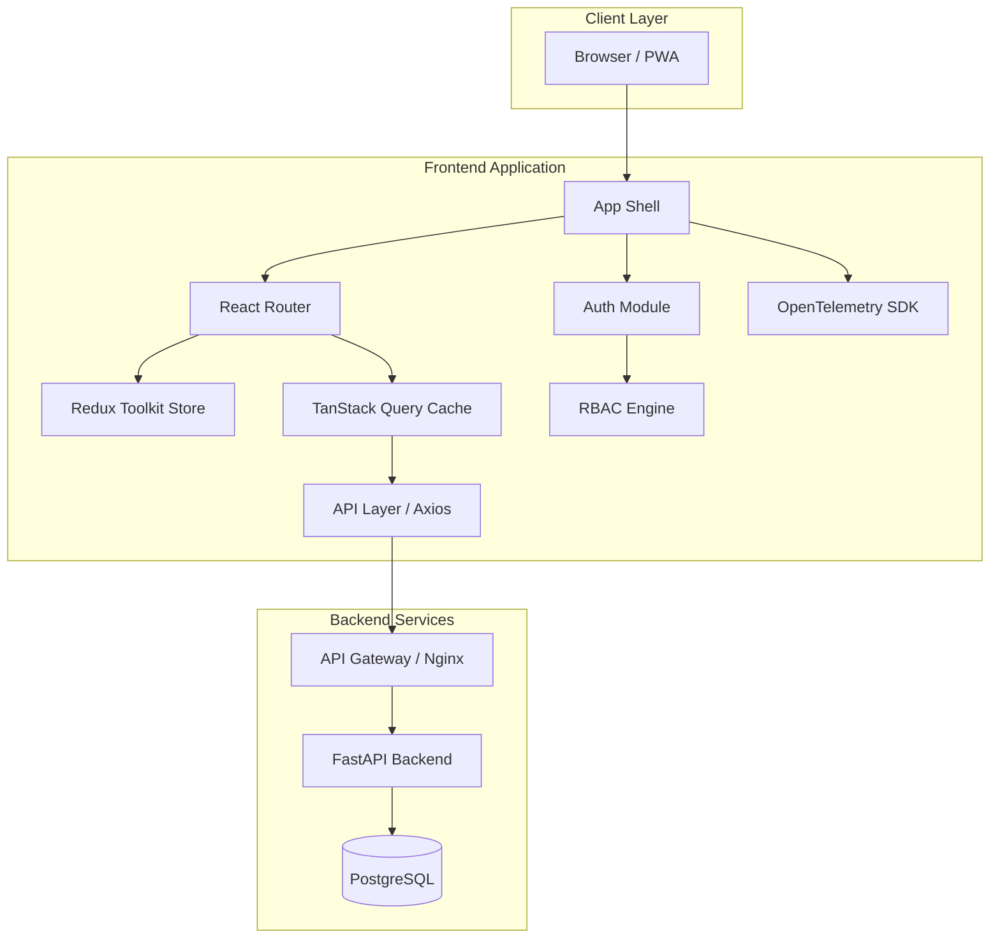
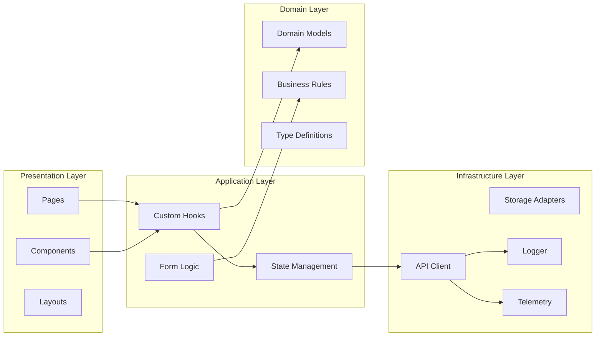
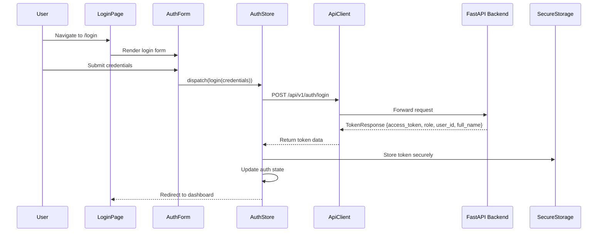
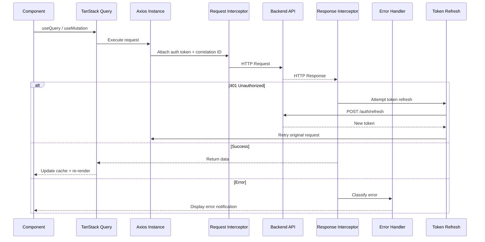
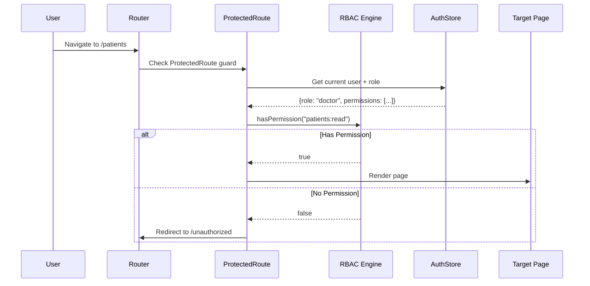
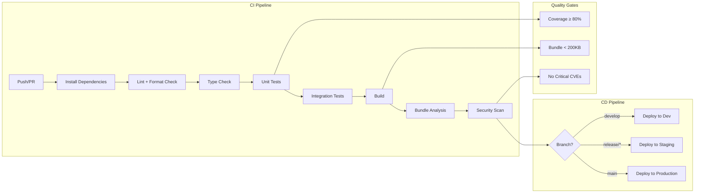

# Design Document: Enterprise React Architecture for MEDRecords

## Overview

This document defines a comprehensive enterprise-grade React application architecture for the MEDRecords medical records portal. The architecture integrates with the existing Python/FastAPI backend and supports scalable, maintainable, secure, and high-performance frontend development across multiple teams.

The design follows Clean Architecture principles with Domain-Driven Design (DDD), enabling feature-based modular development, cloud-native deployment, CI/CD integration, and enterprise security standards. The architecture supports RBAC, audit logging, observability via OpenTelemetry, and is micro-frontend ready for future scaling.

## Architecture

### High-Level System Architecture



### Layered Architecture



## Sequence Diagrams

### Authentication Flow



### API Request Lifecycle with Interceptors



### RBAC Route Protection Flow



## Components and Interfaces

### Component 1: API Client Layer

**Purpose**: Centralized HTTP communication with the FastAPI backend, handling authentication, retries, error classification, and telemetry.

**Interface**:
```typescript
interface ApiClientConfig {
  baseURL: string;
  timeout: number;
  retryAttempts: number;
  retryDelay: number;
}

interface ApiClient {
  get<T>(url: string, config?: RequestConfig): Promise<ApiResponse<T>>;
  post<T>(url: string, data?: unknown, config?: RequestConfig): Promise<ApiResponse<T>>;
  put<T>(url: string, data?: unknown, config?: RequestConfig): Promise<ApiResponse<T>>;
  patch<T>(url: string, data?: unknown, config?: RequestConfig): Promise<ApiResponse<T>>;
  delete<T>(url: string, config?: RequestConfig): Promise<ApiResponse<T>>;
}

interface ApiResponse<T> {
  data: T;
  status: number;
  headers: Record<string, string>;
  correlationId: string;
}

interface RequestConfig {
  params?: Record<string, unknown>;
  headers?: Record<string, string>;
  signal?: AbortSignal;
  skipAuth?: boolean;
  skipRetry?: boolean;
}
```

**Responsibilities**:
- Attach JWT tokens via request interceptors
- Generate and propagate correlation IDs for distributed tracing
- Implement exponential backoff retry strategy for transient failures
- Classify errors into categories (network, auth, validation, server)
- Emit telemetry spans for all outbound requests

### Component 2: Authentication Module

**Purpose**: Manage user authentication state, token lifecycle, and session management.

**Interface**:
```typescript
interface AuthState {
  user: UserProfile | null;
  token: string | null;
  isAuthenticated: boolean;
  isLoading: boolean;
  error: AuthError | null;
}

interface UserProfile {
  id: number;
  username: string;
  email: string;
  fullName: string;
  role: UserRole;
  specialty: string | null;
  isActive: boolean;
}

type UserRole = 'admin' | 'doctor' | 'nurse' | 'receptionist' | 'auditor';

interface AuthActions {
  login(credentials: LoginCredentials): Promise<TokenResponse>;
  logout(): Promise<void>;
  refreshToken(): Promise<string>;
  getProfile(): Promise<UserProfile>;
  isTokenExpired(): boolean;
}

interface LoginCredentials {
  username: string;
  password: string;
}

interface TokenResponse {
  access_token: string;
  token_type: string;
  role: UserRole;
  user_id: number;
  full_name: string;
}
```

**Responsibilities**:
- Handle login/logout flows with audit trail integration
- Manage JWT token storage in memory (not localStorage for security)
- Automatic token refresh before expiration
- Broadcast auth state changes to all tabs via BroadcastChannel API
- Clear sensitive data on logout

### Component 3: RBAC Authorization Engine

**Purpose**: Enforce role-based access control at both route and component levels.

**Interface**:
```typescript
interface Permission {
  resource: string;
  action: 'create' | 'read' | 'update' | 'delete' | 'export' | 'manage';
}

interface RolePermissionMap {
  [role: string]: Permission[];
}

interface RBACEngine {
  hasPermission(user: UserProfile, permission: Permission): boolean;
  hasAnyPermission(user: UserProfile, permissions: Permission[]): boolean;
  hasAllPermissions(user: UserProfile, permissions: Permission[]): boolean;
  getPermissionsForRole(role: UserRole): Permission[];
}

// React components for declarative access control
interface ProtectedRouteProps {
  permission: Permission | Permission[];
  requireAll?: boolean;
  fallback?: React.ReactNode;
  redirectTo?: string;
  children: React.ReactNode;
}

interface PermissionGateProps {
  permission: Permission | Permission[];
  requireAll?: boolean;
  fallback?: React.ReactNode;
  children: React.ReactNode;
}
```

**Responsibilities**:
- Define permission matrix mapping roles to allowed actions on resources
- Provide `<ProtectedRoute>` component for route-level guards
- Provide `<PermissionGate>` component for UI element visibility
- Support both single permission and compound permission checks
- Cache permission lookups for performance

### Component 4: State Management Layer

**Purpose**: Coordinate application state across Redux Toolkit (global/client state) and TanStack Query (server state).

**Interface**:
```typescript
// Redux Store Structure
interface RootState {
  auth: AuthState;
  ui: UIState;
  notifications: NotificationState;
  preferences: UserPreferencesState;
}

interface UIState {
  sidebarCollapsed: boolean;
  theme: 'light' | 'dark' | 'system';
  locale: string;
  breadcrumbs: Breadcrumb[];
}

interface NotificationState {
  items: AppNotification[];
  unreadCount: number;
}

// TanStack Query Key Factory
interface QueryKeys {
  patients: {
    all: readonly ['patients'];
    list: (filters: PatientFilters) => readonly ['patients', 'list', PatientFilters];
    detail: (id: number) => readonly ['patients', 'detail', number];
  };
  assessments: {
    all: readonly ['assessments'];
    byPatient: (patientId: number) => readonly ['assessments', 'byPatient', number];
    detail: (id: number) => readonly ['assessments', 'detail', number];
  };
  // ... per feature module
}
```

**Responsibilities**:
- Redux Toolkit: UI state, auth state, user preferences, notifications
- TanStack Query: All server data with optimistic updates, cache invalidation
- Maintain clear separation between client state and server state
- Provide typed selectors and hooks per feature

### Component 5: Error Handling Infrastructure

**Purpose**: Unified error classification, reporting, and user-facing error display.

**Interface**:
```typescript
enum ErrorCategory {
  NETWORK = 'NETWORK',
  AUTHENTICATION = 'AUTHENTICATION',
  AUTHORIZATION = 'AUTHORIZATION',
  VALIDATION = 'VALIDATION',
  NOT_FOUND = 'NOT_FOUND',
  SERVER = 'SERVER',
  TIMEOUT = 'TIMEOUT',
  UNKNOWN = 'UNKNOWN',
}

interface AppError {
  category: ErrorCategory;
  message: string;
  code?: string;
  statusCode?: number;
  correlationId?: string;
  timestamp: string;
  context?: Record<string, unknown>;
}

interface ErrorBoundaryProps {
  fallback: React.ComponentType<ErrorFallbackProps>;
  onError?: (error: Error, errorInfo: React.ErrorInfo) => void;
  resetKeys?: unknown[];
  children: React.ReactNode;
}

interface ErrorHandler {
  classify(error: unknown): AppError;
  report(error: AppError): void;
  notify(error: AppError): void;
  isRetryable(error: AppError): boolean;
}
```

**Responsibilities**:
- Classify all errors into categories for appropriate handling
- Provide React Error Boundaries at layout, feature, and component levels
- Report errors to telemetry pipeline with correlation IDs
- Display user-friendly error messages via toast notifications
- Support retry actions for transient failures

### Component 6: Observability & Telemetry

**Purpose**: Structured logging, distributed tracing, and performance monitoring via OpenTelemetry.

**Interface**:
```typescript
interface TelemetryConfig {
  serviceName: string;
  serviceVersion: string;
  environment: string;
  collectorEndpoint: string;
  samplingRate: number;
}

interface Logger {
  debug(message: string, context?: LogContext): void;
  info(message: string, context?: LogContext): void;
  warn(message: string, context?: LogContext): void;
  error(message: string, error?: Error, context?: LogContext): void;
}

interface LogContext {
  correlationId?: string;
  userId?: number;
  feature?: string;
  action?: string;
  [key: string]: unknown;
}

interface PerformanceMonitor {
  startSpan(name: string, attributes?: SpanAttributes): Span;
  measureNavigation(route: string): void;
  measureApiCall(method: string, url: string, duration: number): void;
  reportWebVitals(metrics: WebVitalsMetrics): void;
}
```

**Responsibilities**:
- Initialize OpenTelemetry SDK with trace context propagation
- Structured JSON logging with correlation ID threading
- Track Web Vitals (LCP, FID, CLS, TTFB, INP)
- Instrument route changes, API calls, and user interactions
- Export traces to configurable collector endpoint

## Data Models

### Model 1: Patient

```typescript
interface Patient {
  id: number;
  firstName: string;
  lastName: string;
  dateOfBirth: string; // ISO 8601
  gender: 'male' | 'female' | 'other';
  contactNumber: string;
  email?: string;
  address?: string;
  medicalRecordNumber: string;
  registeredBy: number;
  createdAt: string;
  updatedAt: string;
}

interface PatientFilters {
  search?: string;
  gender?: string;
  registeredBy?: number;
  page: number;
  pageSize: number;
  sortBy?: string;
  sortOrder?: 'asc' | 'desc';
}

interface PaginatedResponse<T> {
  items: T[];
  total: number;
  page: number;
  pageSize: number;
  totalPages: number;
}
```

**Validation Rules (Zod Schema)**:
```typescript
const patientSchema = z.object({
  firstName: z.string().min(1).max(100),
  lastName: z.string().min(1).max(100),
  dateOfBirth: z.string().datetime(),
  gender: z.enum(['male', 'female', 'other']),
  contactNumber: z.string().regex(/^\+?[\d\s-]{7,15}$/),
  email: z.string().email().optional(),
  address: z.string().max(500).optional(),
  medicalRecordNumber: z.string().min(1).max(50),
});
```

### Model 2: Assessment

```typescript
interface Assessment {
  id: number;
  patientId: number;
  doctorId: number;
  diseaseId: number;
  templateId: number;
  status: 'draft' | 'in_progress' | 'completed' | 'locked';
  formData: Record<string, unknown>;
  lockedAt?: string;
  lockedBy?: number;
  createdAt: string;
  updatedAt: string;
}

interface AssessmentCreateDTO {
  patientId: number;
  diseaseId: number;
  templateId: number;
  formData: Record<string, unknown>;
}
```

**Validation Rules**:
- `patientId` must reference an existing patient
- `diseaseId` must reference an active disease
- `templateId` must match the selected disease's template
- `formData` must validate against the template schema
- Only doctors can create assessments
- Locked assessments cannot be modified

### Model 3: AuditLog (Read-Only)

```typescript
interface AuditLog {
  id: number;
  eventType: string;
  actorId: number | null;
  actorUsername: string;
  actorRole: string;
  description: string | null;
  ipAddress: string | null;
  createdAt: string;
}

interface AuditLogFilters {
  eventType?: string;
  actorUsername?: string;
  startDate?: string;
  endDate?: string;
  page: number;
  pageSize: number;
}
```

## Enterprise Folder Structure

```
medrecords-frontend/
├── public/
│   ├── favicon.ico
│   ├── manifest.json
│   └── locales/                    # i18n translation files
│       ├── en/
│       └── fr/
├── src/
│   ├── app/                        # Application shell
│   │   ├── App.tsx                 # Root component
│   │   ├── providers/              # Context providers composition
│   │   │   ├── AppProviders.tsx    # Provider composition root
│   │   │   ├── AuthProvider.tsx
│   │   │   ├── ThemeProvider.tsx
│   │   │   ├── QueryProvider.tsx
│   │   │   └── TelemetryProvider.tsx
│   │   ├── store/                  # Redux store configuration
│   │   │   ├── index.ts           # Store creation + middleware
│   │   │   ├── rootReducer.ts     # Combined reducers
│   │   │   └── middleware/
│   │   │       ├── logger.ts
│   │   │       └── telemetry.ts
│   │   ├── router/                 # Routing configuration
│   │   │   ├── index.tsx          # Router definition
│   │   │   ├── routes.ts          # Route constants
│   │   │   ├── ProtectedRoute.tsx
│   │   │   └── LazyRoutes.tsx     # Code-split route imports
│   │   └── layouts/               # Page layouts
│   │       ├── MainLayout.tsx
│   │       ├── AuthLayout.tsx
│   │       └── components/
│   │           ├── Header.tsx
│   │           ├── Sidebar.tsx
│   │           └── Footer.tsx
│   ├── shared/                     # Cross-cutting shared code
│   │   ├── components/            # Reusable UI components
│   │   │   ├── DataTable/
│   │   │   ├── FormField/
│   │   │   ├── Modal/
│   │   │   ├── LoadingSpinner/
│   │   │   ├── ErrorFallback/
│   │   │   ├── PermissionGate/
│   │   │   └── index.ts
│   │   ├── hooks/                 # Shared custom hooks
│   │   │   ├── useDebounce.ts
│   │   │   ├── usePagination.ts
│   │   │   ├── usePermission.ts
│   │   │   ├── useLocalStorage.ts
│   │   │   └── index.ts
│   │   ├── services/              # Shared services
│   │   │   ├── api/
│   │   │   │   ├── apiClient.ts   # Axios instance + interceptors
│   │   │   │   ├── apiConfig.ts
│   │   │   │   └── index.ts
│   │   │   ├── storage/
│   │   │   │   ├── secureStorage.ts
│   │   │   │   └── index.ts
│   │   │   └── index.ts
│   │   ├── utils/                 # Pure utility functions
│   │   │   ├── date.ts
│   │   │   ├── format.ts
│   │   │   ├── validation.ts
│   │   │   └── index.ts
│   │   ├── constants/             # Application constants
│   │   │   ├── routes.ts
│   │   │   ├── permissions.ts
│   │   │   ├── queryKeys.ts
│   │   │   └── index.ts
│   │   ├── types/                 # Shared TypeScript types
│   │   │   ├── api.ts
│   │   │   ├── auth.ts
│   │   │   ├── common.ts
│   │   │   └── index.ts
│   │   └── styles/                # Global styles + theme
│   │       ├── theme.ts
│   │       ├── global.css
│   │       └── variables.css
│   ├── features/                   # Feature modules (DDD bounded contexts)
│   │   ├── authentication/
│   │   │   ├── api/               # Feature-specific API calls
│   │   │   │   └── authApi.ts
│   │   │   ├── components/        # Feature components
│   │   │   │   ├── LoginForm.tsx
│   │   │   │   └── LogoutButton.tsx
│   │   │   ├── pages/            # Feature pages
│   │   │   │   └── LoginPage.tsx
│   │   │   ├── hooks/            # Feature hooks
│   │   │   │   └── useAuth.ts
│   │   │   ├── store/            # Feature Redux slice
│   │   │   │   └── authSlice.ts
│   │   │   ├── models/           # Feature types/interfaces
│   │   │   │   └── auth.types.ts
│   │   │   └── routes.ts         # Feature route definitions
│   │   ├── patient-management/
│   │   │   ├── api/
│   │   │   ├── components/
│   │   │   ├── pages/
│   │   │   ├── hooks/
│   │   │   ├── store/
│   │   │   ├── models/
│   │   │   └── routes.ts
│   │   ├── assessments/
│   │   ├── dashboard/
│   │   ├── reports/
│   │   ├── notifications/
│   │   ├── audit/
│   │   ├── user-management/
│   │   └── prescriptions/
│   ├── core/                       # Cross-cutting infrastructure
│   │   ├── security/
│   │   │   ├── rbac.ts           # RBAC engine
│   │   │   ├── permissions.ts    # Permission definitions
│   │   │   ├── csp.ts           # CSP configuration
│   │   │   └── sanitize.ts      # XSS prevention
│   │   ├── logging/
│   │   │   ├── logger.ts         # Structured logger
│   │   │   └── logLevels.ts
│   │   ├── monitoring/
│   │   │   ├── telemetry.ts      # OpenTelemetry setup
│   │   │   ├── webVitals.ts      # Web Vitals reporting
│   │   │   └── spans.ts
│   │   ├── error-handling/
│   │   │   ├── ErrorBoundary.tsx
│   │   │   ├── errorClassifier.ts
│   │   │   └── errorReporter.ts
│   │   └── i18n/
│   │       ├── config.ts
│   │       └── useTranslation.ts
│   ├── assets/
│   │   ├── images/
│   │   ├── icons/
│   │   └── fonts/
│   └── index.tsx                   # Entry point
├── tests/
│   ├── unit/
│   ├── integration/
│   └── e2e/
│       ├── fixtures/
│       ├── pages/                  # Page Object Models
│       └── specs/
├── .env
├── .env.development
├── .env.staging
├── .env.production
├── .eslintrc.cjs
├── .prettierrc
├── Dockerfile
├── nginx.conf
├── package.json
├── tsconfig.json
├── vite.config.ts
├── vitest.config.ts
├── playwright.config.ts
└── docker-compose.yml
```

## Algorithmic Pseudocode

### Token Refresh with Race Condition Prevention

```typescript
// Singleton token refresh to prevent multiple simultaneous refresh attempts
let refreshPromise: Promise<string> | null = null;

async function refreshTokenWithLock(): Promise<string> {
  // If a refresh is already in progress, wait for it
  if (refreshPromise) {
    return refreshPromise;
  }

  refreshPromise = (async () => {
    try {
      const response = await apiClient.post<TokenResponse>(
        '/auth/refresh',
        {},
        { skipAuth: true, skipRetry: true }
      );
      const newToken = response.data.access_token;
      tokenStore.setToken(newToken);
      return newToken;
    } finally {
      refreshPromise = null;
    }
  })();

  return refreshPromise;
}
```

**Preconditions:**
- Current token exists but is expired or about to expire
- Refresh endpoint is available on backend

**Postconditions:**
- On success: new valid token is stored and returned
- On failure: user is redirected to login
- Only one refresh request is in-flight at any time

**Loop Invariants:** N/A (single execution path)

### Retry Strategy with Exponential Backoff

```typescript
async function executeWithRetry<T>(
  requestFn: () => Promise<T>,
  config: RetryConfig = { maxAttempts: 3, baseDelay: 1000, maxDelay: 10000 }
): Promise<T> {
  let lastError: Error | null = null;

  for (let attempt = 0; attempt < config.maxAttempts; attempt++) {
    try {
      return await requestFn();
    } catch (error) {
      lastError = error as Error;
      const appError = errorClassifier.classify(error);

      // Only retry on transient failures
      if (!isRetryableError(appError) || attempt === config.maxAttempts - 1) {
        throw error;
      }

      // Exponential backoff with jitter
      const delay = Math.min(
        config.baseDelay * Math.pow(2, attempt) + Math.random() * 1000,
        config.maxDelay
      );

      await sleep(delay);
    }
  }

  throw lastError;
}

function isRetryableError(error: AppError): boolean {
  return [
    ErrorCategory.NETWORK,
    ErrorCategory.TIMEOUT,
    ErrorCategory.SERVER,
  ].includes(error.category) && (error.statusCode === undefined || error.statusCode >= 500);
}
```

**Preconditions:**
- `requestFn` is an idempotent async operation (safe to retry)
- `config.maxAttempts >= 1`
- `config.baseDelay > 0`

**Postconditions:**
- Returns the result of `requestFn()` on first success
- Throws the last error after all retry attempts exhausted
- Non-retryable errors are thrown immediately without retry
- Total wait time ≤ sum of geometric series bounded by `maxDelay`

**Loop Invariants:**
- `attempt` increments monotonically from 0 to `maxAttempts - 1`
- Each iteration either returns successfully or increments attempt counter
- Delay between retries grows exponentially bounded by `maxDelay`

### RBAC Permission Resolution Algorithm

```typescript
// Permission matrix definition
const ROLE_PERMISSIONS: RolePermissionMap = {
  admin: [
    { resource: '*', action: 'manage' },
  ],
  doctor: [
    { resource: 'patients', action: 'read' },
    { resource: 'patients', action: 'create' },
    { resource: 'patients', action: 'update' },
    { resource: 'assessments', action: 'read' },
    { resource: 'assessments', action: 'create' },
    { resource: 'assessments', action: 'update' },
    { resource: 'prescriptions', action: 'create' },
    { resource: 'prescriptions', action: 'read' },
    { resource: 'reports', action: 'read' },
    { resource: 'reports', action: 'export' },
  ],
  nurse: [
    { resource: 'patients', action: 'read' },
    { resource: 'patients', action: 'create' },
    { resource: 'assessments', action: 'read' },
    { resource: 'followups', action: 'read' },
    { resource: 'followups', action: 'create' },
  ],
  receptionist: [
    { resource: 'patients', action: 'read' },
    { resource: 'patients', action: 'create' },
  ],
  auditor: [
    { resource: 'audit', action: 'read' },
    { resource: 'reports', action: 'read' },
    { resource: 'reports', action: 'export' },
  ],
};

function hasPermission(user: UserProfile, required: Permission): boolean {
  const userPermissions = ROLE_PERMISSIONS[user.role] ?? [];

  return userPermissions.some((perm) => {
    // Wildcard resource with manage action grants everything
    if (perm.resource === '*' && perm.action === 'manage') {
      return true;
    }
    // Exact match on resource
    if (perm.resource !== required.resource) {
      return false;
    }
    // 'manage' action on specific resource grants all actions for that resource
    if (perm.action === 'manage') {
      return true;
    }
    // Exact action match
    return perm.action === required.action;
  });
}
```

**Preconditions:**
- `user` has a valid `role` field matching a key in `ROLE_PERMISSIONS`
- `required` has non-empty `resource` and valid `action`

**Postconditions:**
- Returns `true` if user's role grants the required permission
- Admin with wildcard always returns `true`
- Returns `false` for undefined roles (empty permission set)

**Loop Invariants:**
- Iterates through user's permissions; returns `true` on first match
- If no match found after full iteration, returns `false`

### Lazy Loading with Route-Based Code Splitting

```typescript
import { lazy, Suspense } from 'react';
import { RouteObject } from 'react-router-dom';

// Factory for lazy-loaded feature modules
function createLazyRoute(
  importFn: () => Promise<{ default: React.ComponentType }>,
  fallback: React.ReactNode = <LoadingSpinner />
): React.ReactNode {
  const LazyComponent = lazy(importFn);
  return (
    <Suspense fallback={fallback}>
      <LazyComponent />
    </Suspense>
  );
}

// Route configuration with code splitting
const featureRoutes: RouteObject[] = [
  {
    path: '/dashboard',
    element: createLazyRoute(() => import('@/features/dashboard/pages/DashboardPage')),
  },
  {
    path: '/patients/*',
    element: createLazyRoute(() => import('@/features/patient-management/pages/PatientsPage')),
  },
  {
    path: '/assessments/*',
    element: createLazyRoute(() => import('@/features/assessments/pages/AssessmentsPage')),
  },
  {
    path: '/reports/*',
    element: createLazyRoute(() => import('@/features/reports/pages/ReportsPage')),
  },
  {
    path: '/audit/*',
    element: createLazyRoute(() => import('@/features/audit/pages/AuditPage')),
  },
];
```

**Preconditions:**
- Vite bundler configured with automatic chunk splitting
- Each feature module has a default export page component

**Postconditions:**
- Each feature bundle loads independently on first navigation
- Loading spinner displays during chunk download
- Failed chunk loads are caught by ErrorBoundary

## Key Functions with Formal Specifications

### Function: createApiClient()

```typescript
function createApiClient(config: ApiClientConfig): ApiClient {
  const instance = axios.create({
    baseURL: config.baseURL,
    timeout: config.timeout,
    headers: { 'Content-Type': 'application/json' },
  });

  // Request interceptor: attach auth token + correlation ID
  instance.interceptors.request.use((reqConfig) => {
    const token = tokenStore.getToken();
    if (token && !reqConfig.headers?.['X-Skip-Auth']) {
      reqConfig.headers.Authorization = `Bearer ${token}`;
    }
    reqConfig.headers['X-Correlation-ID'] = generateCorrelationId();
    return reqConfig;
  });

  // Response interceptor: handle 401 with token refresh
  instance.interceptors.response.use(
    (response) => response,
    async (error) => {
      if (error.response?.status === 401 && !error.config._retried) {
        error.config._retried = true;
        try {
          const newToken = await refreshTokenWithLock();
          error.config.headers.Authorization = `Bearer ${newToken}`;
          return instance(error.config);
        } catch {
          authStore.logout();
          throw error;
        }
      }
      throw error;
    }
  );

  return wrapAxiosInstance(instance);
}
```

**Preconditions:**
- `config.baseURL` is a valid URL pointing to the FastAPI backend
- `config.timeout > 0` (milliseconds)
- Token store is initialized

**Postconditions:**
- Returns an ApiClient instance with interceptors configured
- All requests include `X-Correlation-ID` header
- Authenticated requests include `Authorization: Bearer <token>` header
- 401 responses trigger exactly one token refresh attempt before failing

### Function: useDataTable() Hook

```typescript
function useDataTable<T>(
  queryKey: readonly unknown[],
  fetchFn: (params: PaginationParams) => Promise<PaginatedResponse<T>>,
  options?: DataTableOptions
): DataTableResult<T> {
  const [pagination, setPagination] = useState<PaginationState>({
    page: 1,
    pageSize: options?.defaultPageSize ?? 20,
    sortBy: options?.defaultSortBy,
    sortOrder: options?.defaultSortOrder ?? 'asc',
  });

  const [filters, setFilters] = useState<Record<string, unknown>>({});

  const query = useQuery({
    queryKey: [...queryKey, pagination, filters],
    queryFn: () => fetchFn({ ...pagination, ...filters }),
    keepPreviousData: true,
    staleTime: options?.staleTime ?? 30_000,
  });

  return {
    data: query.data?.items ?? [],
    total: query.data?.total ?? 0,
    totalPages: query.data?.totalPages ?? 0,
    isLoading: query.isLoading,
    isFetching: query.isFetching,
    error: query.error,
    pagination,
    setPagination,
    filters,
    setFilters,
    refetch: query.refetch,
  };
}
```

**Preconditions:**
- `queryKey` uniquely identifies this data set
- `fetchFn` returns a valid `PaginatedResponse<T>`
- Component is wrapped in `QueryClientProvider`

**Postconditions:**
- Returns reactive data table state bound to server data
- Pagination changes trigger automatic re-fetch
- Previous data remains visible during new fetch (no flicker)
- Cache invalidation follows TanStack Query rules

### Function: usePermission() Hook

```typescript
function usePermission(
  permission: Permission | Permission[],
  options?: { requireAll?: boolean }
): PermissionResult {
  const { user } = useAppSelector(selectAuth);
  const rbac = useRBACEngine();

  const hasAccess = useMemo(() => {
    if (!user) return false;
    const permissions = Array.isArray(permission) ? permission : [permission];

    if (options?.requireAll) {
      return permissions.every((p) => rbac.hasPermission(user, p));
    }
    return permissions.some((p) => rbac.hasPermission(user, p));
  }, [user, permission, options?.requireAll, rbac]);

  return { hasAccess, isLoading: user === null, user };
}
```

**Preconditions:**
- Hook is called within a component rendered under `AuthProvider`
- `permission` contains valid resource/action pairs

**Postconditions:**
- `hasAccess` is `true` only if user has required permission(s)
- `isLoading` is `true` while user profile is being loaded
- Result is memoized and only recalculated on user/permission change

## Example Usage

### Complete Feature Module Example: Patient Management

```typescript
// features/patient-management/models/patient.types.ts
export interface Patient {
  id: number;
  firstName: string;
  lastName: string;
  dateOfBirth: string;
  gender: 'male' | 'female' | 'other';
  contactNumber: string;
  medicalRecordNumber: string;
}

// features/patient-management/api/patientApi.ts
import { apiClient } from '@/shared/services/api';
import type { Patient, PatientFilters, PaginatedResponse } from '../models/patient.types';

export const patientApi = {
  getAll: (params: PatientFilters) =>
    apiClient.get<PaginatedResponse<Patient>>('/patients', { params }),

  getById: (id: number) =>
    apiClient.get<Patient>(`/patients/${id}`),

  create: (data: Omit<Patient, 'id' | 'createdAt' | 'updatedAt'>) =>
    apiClient.post<Patient>('/patients', data),

  update: (id: number, data: Partial<Patient>) =>
    apiClient.patch<Patient>(`/patients/${id}`, data),
};

// features/patient-management/hooks/usePatients.ts
import { useQuery, useMutation, useQueryClient } from '@tanstack/react-query';
import { patientApi } from '../api/patientApi';
import { queryKeys } from '@/shared/constants/queryKeys';

export function usePatients(filters: PatientFilters) {
  return useQuery({
    queryKey: queryKeys.patients.list(filters),
    queryFn: () => patientApi.getAll(filters),
    staleTime: 30_000,
  });
}

export function useCreatePatient() {
  const queryClient = useQueryClient();

  return useMutation({
    mutationFn: patientApi.create,
    onSuccess: () => {
      queryClient.invalidateQueries({ queryKey: queryKeys.patients.all });
    },
  });
}

// features/patient-management/pages/PatientsListPage.tsx
import { usePatients } from '../hooks/usePatients';
import { DataTable } from '@/shared/components/DataTable';
import { PermissionGate } from '@/shared/components/PermissionGate';

export default function PatientsListPage() {
  const [filters, setFilters] = useState<PatientFilters>({ page: 1, pageSize: 20 });
  const { data, isLoading, error } = usePatients(filters);

  return (
    <div className="patients-page">
      <header>
        <h1>{t('patients.title')}</h1>
        <PermissionGate permission={{ resource: 'patients', action: 'create' }}>
          <Button label={t('patients.add')} onClick={openCreateModal} />
        </PermissionGate>
      </header>

      <DataTable
        data={data?.items ?? []}
        total={data?.total ?? 0}
        loading={isLoading}
        pagination={filters}
        onPaginationChange={setFilters}
        columns={patientColumns}
      />
    </div>
  );
}
```

### Provider Composition Pattern

```typescript
// app/providers/AppProviders.tsx
import { Provider as ReduxProvider } from 'react-redux';
import { QueryClientProvider } from '@tanstack/react-query';
import { store } from '@/app/store';
import { queryClient } from '@/shared/services/api/queryClient';
import { AuthProvider } from './AuthProvider';
import { ThemeProvider } from './ThemeProvider';
import { TelemetryProvider } from './TelemetryProvider';
import { ErrorBoundary } from '@/core/error-handling/ErrorBoundary';

export function AppProviders({ children }: { children: React.ReactNode }) {
  return (
    <ErrorBoundary fallback={AppErrorFallback}>
      <ReduxProvider store={store}>
        <QueryClientProvider client={queryClient}>
          <TelemetryProvider>
            <AuthProvider>
              <ThemeProvider>
                {children}
              </ThemeProvider>
            </AuthProvider>
          </TelemetryProvider>
        </QueryClientProvider>
      </ReduxProvider>
    </ErrorBoundary>
  );
}
```

### Form with Validation Example

```typescript
// features/patient-management/components/PatientForm.tsx
import { useForm } from 'react-hook-form';
import { zodResolver } from '@hookform/resolvers/zod';
import { patientSchema } from '../models/patient.validation';
import { useCreatePatient } from '../hooks/usePatients';

export function PatientForm({ onSuccess }: { onSuccess: () => void }) {
  const { mutate: createPatient, isPending } = useCreatePatient();

  const form = useForm({
    resolver: zodResolver(patientSchema),
    defaultValues: {
      firstName: '',
      lastName: '',
      dateOfBirth: '',
      gender: 'male' as const,
      contactNumber: '',
      medicalRecordNumber: '',
    },
  });

  const onSubmit = form.handleSubmit((data) => {
    createPatient(data, {
      onSuccess: () => {
        form.reset();
        onSuccess();
      },
    });
  });

  return (
    <form onSubmit={onSubmit} aria-label="Patient registration form">
      <FormField
        label={t('patient.firstName')}
        error={form.formState.errors.firstName?.message}
        {...form.register('firstName')}
      />
      {/* Additional fields... */}
      <Button type="submit" loading={isPending} label={t('common.save')} />
    </form>
  );
}
```

## Correctness Properties

*A property is a characteristic or behavior that should hold true across all valid executions of a system-essentially, a formal statement about what the system should do. Properties serve as the bridge between human-readable specifications and machine-verifiable correctness guarantees.*

### Property 1: Error Classification Totality

*For any* input value (including undefined, null, Error objects, AxiosError objects, and arbitrary values), the error classifier SHALL produce exactly one valid ErrorCategory and a non-empty message string with a valid timestamp.

**Validates: Requirements 1.7, 5.7**

### Property 2: Auth Header Correctness

*For any* API request configuration, the Authorization header SHALL be present with a valid Bearer token if and only if a token exists in the token store AND the request's skipAuth flag is not true.

**Validates: Requirements 1.1, 1.6**

### Property 3: Correlation ID Uniqueness

*For any* set of N API requests made by the API_Client, each request SHALL have a distinct X-Correlation-ID header value, and all values SHALL be valid UUID or unique string identifiers.

**Validates: Requirements 1.2**

### Property 4: Retry Termination and Exponential Backoff

*For any* sequence of transient failures (network errors, timeouts, or HTTP 5xx responses), the retry loop SHALL terminate after at most maxAttempts iterations, and the delay between consecutive retries SHALL grow exponentially while remaining bounded by maxDelay.

**Validates: Requirements 1.3**

### Property 5: Non-Retryable Error Immediate Propagation

*For any* HTTP 4xx error response (excluding 401), the API_Client SHALL invoke the request function exactly once and propagate the error immediately without any retry delay.

**Validates: Requirements 1.4**

### Property 6: Token Refresh Atomicity

*For any* number N of concurrent HTTP 401 responses received simultaneously, the Auth_Module SHALL issue at most one token refresh request and distribute the resulting token (or error) to all N waiting callers.

**Validates: Requirements 2.5, 1.5**

### Property 7: Logout State Completeness

*For any* authenticated session state (regardless of user role, stored preferences, or in-flight requests), after logout completes, no in-memory variable or browser storage SHALL contain the previous user's token, profile data, or session identifiers.

**Validates: Requirements 2.6**

### Property 8: Token Storage Security

*For any* sequence of authentication operations (login, refresh, API calls), the JWT token SHALL never appear in localStorage or sessionStorage at any point during or after the operation.

**Validates: Requirements 2.3**

### Property 9: Admin Role Totality

*For any* resource string and any action string in the system's permission space, evaluating hasPermission for a user with the admin role SHALL return true.

**Validates: Requirements 3.2**

### Property 10: Permission Gate Correctness

*For any* user role, set of required permissions, and requireAll flag value, the PermissionGate component SHALL render its children if and only if: (a) when requireAll is true, the user holds ALL specified permissions; or (b) when requireAll is false or omitted, the user holds at least ONE of the specified permissions. When access is denied at a route level, the user SHALL be redirected to /unauthorized.

**Validates: Requirements 3.3, 3.4, 3.5, 3.6**

### Property 11: Optimistic Update Rollback

*For any* optimistic mutation that is subsequently rejected by the server, the application state SHALL revert to be identical to the pre-mutation state, with no residual optimistic data visible in the UI or cache.

**Validates: Requirements 4.5**

### Property 12: Error Boundary Containment

*For any* unhandled JavaScript exception thrown within a Feature_Module's component tree, the error SHALL be caught by the nearest Error_Boundary and a fallback UI SHALL be rendered, while all other Feature_Modules and the application shell remain functional.

**Validates: Requirements 5.1**

### Property 13: Validation Error Field Mapping

*For any* server validation error response (HTTP 422) containing N field-level errors, the Error_Handler SHALL map each field error to its corresponding form field, resulting in exactly N inline error messages displayed adjacent to their respective fields.

**Validates: Requirements 5.3, 8.2**

### Property 14: Error Report Completeness

*For any* error caught by the Error_Handler, the telemetry report SHALL include a valid Correlation_ID, the classified ErrorCategory, an ISO 8601 timestamp, and all available context. When displayed to the user, server errors SHALL include the Correlation_ID in the visible message.

**Validates: Requirements 5.4, 5.5**

### Property 15: API Telemetry Span Creation

*For any* API request made through the API_Client, the Telemetry_System SHALL create a trace span containing the HTTP method, request URL, response duration, and response status code as span attributes.

**Validates: Requirements 6.2**

### Property 16: Structured Log Completeness

*For any* log emission (debug, info, warn, or error level), the output SHALL be valid JSON containing level, message, timestamp, and optionally correlationId, userId, and feature fields when available in context.

**Validates: Requirements 6.3**

### Property 17: Navigation Span Recording

*For any* route navigation event, the Telemetry_System SHALL record a trace span containing both the source route path and the destination route path as span attributes.

**Validates: Requirements 6.5**

### Property 18: Code Split Independence

*For any* two distinct Feature_Modules F1 and F2, navigating to F1's route SHALL download only F1's code bundle and SHALL NOT trigger the download of F2's bundle.

**Validates: Requirements 7.2**

### Property 19: Patient Schema Validation Correctness

*For any* patient data object, the Zod validation schema SHALL accept it if and only if: firstName and lastName are non-empty strings (max 100 chars), dateOfBirth is a valid ISO 8601 date, gender is one of male/female/other, contactNumber matches the phone pattern (7-15 digits with optional + prefix), and email (if provided) is a valid email format.

**Validates: Requirements 8.1, 8.3, 8.4, 8.5**

### Property 20: HTML Sanitization Safety

*For any* arbitrary HTML string input, the sanitization function SHALL produce output that contains no executable script elements, no event handler attributes (onclick, onerror, etc.), and no javascript: protocol URLs, while preserving safe HTML structure.

**Validates: Requirements 9.2**

### Property 21: Locale-Aware Formatting Consistency

*For any* date or number value and any supported locale, the formatting functions SHALL produce output consistent with the Intl API's conventions for that locale, and switching locales SHALL change the formatted output accordingly.

**Validates: Requirements 12.4**

## Error Handling

### Error Scenario 1: Network Failure

**Condition**: API request fails due to network unavailability (no response received)
**Response**: Classify as `ErrorCategory.NETWORK`, show toast with "Connection lost. Please check your network."
**Recovery**: Enable automatic retry with exponential backoff (3 attempts, 1s/2s/4s delays)

### Error Scenario 2: Authentication Expiry (401)

**Condition**: API response returns HTTP 401 while user has an active session
**Response**: Attempt silent token refresh via `refreshTokenWithLock()`
**Recovery**: On refresh success, transparently retry the original request. On refresh failure, clear auth state and redirect to `/login` with return URL preserved.

### Error Scenario 3: Authorization Denied (403)

**Condition**: API response returns HTTP 403 for a resource the user attempted to access
**Response**: Classify as `ErrorCategory.AUTHORIZATION`, show inline error "You don't have permission to perform this action."
**Recovery**: No retry. Log the attempt. Suggest contacting administrator.

### Error Scenario 4: Validation Error (422)

**Condition**: API response returns HTTP 422 with field-level validation errors
**Response**: Map backend validation errors to form field errors using field path matching
**Recovery**: Highlight invalid fields, display server-provided error messages, allow user to correct and resubmit.

### Error Scenario 5: Server Error (500)

**Condition**: API response returns HTTP 5xx
**Response**: Classify as `ErrorCategory.SERVER`, show toast with generic error and correlation ID
**Recovery**: Enable retry button. Log full error context to telemetry with correlation ID for backend debugging.

### Error Scenario 6: Chunk Load Failure

**Condition**: Lazy-loaded route chunk fails to download (network issue or deployment)
**Response**: ErrorBoundary catches the chunk loading error
**Recovery**: Show "New version available" message with page reload button. On reload, the browser fetches the updated chunk manifest.

## Testing Strategy

### Unit Testing Approach

**Tool**: Vitest + React Testing Library

**Coverage Goals**: ≥80% line coverage for core modules, ≥70% for feature modules

**Key Test Cases**:
- RBAC engine: Verify all role-permission combinations
- Error classifier: Verify correct categorization for each HTTP status code
- API interceptors: Verify token attachment, correlation ID generation, retry logic
- Form validation: Verify Zod schemas accept valid data and reject invalid data
- Custom hooks: Verify state transitions and side effects
- Redux slices: Verify reducers produce correct state transitions

**Conventions**:
```typescript
// Test file naming: [module].test.ts or [Component].test.tsx
// Located alongside source: features/auth/hooks/useAuth.test.ts

describe('useAuth', () => {
  it('should set isAuthenticated to true after successful login', async () => {
    // Arrange
    const { result } = renderHook(() => useAuth(), { wrapper: TestProviders });

    // Act
    await act(async () => {
      await result.current.login({ username: 'doctor1', password: 'pass' });
    });

    // Assert
    expect(result.current.isAuthenticated).toBe(true);
    expect(result.current.user?.role).toBe('doctor');
  });
});
```

### Property-Based Testing Approach

**Property Test Library**: fast-check

**Key Properties to Test**:
```typescript
import fc from 'fast-check';

// Property: RBAC admin always has access
test('admin role has permission for any resource/action combination', () => {
  fc.assert(
    fc.property(
      fc.constantFrom('patients', 'assessments', 'reports', 'audit', 'users'),
      fc.constantFrom('create', 'read', 'update', 'delete', 'export', 'manage'),
      (resource, action) => {
        const adminUser = { role: 'admin' } as UserProfile;
        return hasPermission(adminUser, { resource, action });
      }
    )
  );
});

// Property: Pagination invariant
test('paginated response total equals sum of all pages', () => {
  fc.assert(
    fc.property(
      fc.integer({ min: 0, max: 1000 }),
      fc.integer({ min: 1, max: 100 }),
      (total, pageSize) => {
        const totalPages = Math.ceil(total / pageSize);
        return totalPages * pageSize >= total && (totalPages - 1) * pageSize < total;
      }
    )
  );
});

// Property: Error classifier is total (handles all inputs)
test('error classifier produces valid AppError for any input', () => {
  fc.assert(
    fc.property(fc.anything(), (input) => {
      const result = errorClassifier.classify(input);
      return (
        result.category !== undefined &&
        result.message.length > 0 &&
        result.timestamp.length > 0
      );
    })
  );
});
```

### Integration Testing Approach

**Tool**: Vitest with MSW (Mock Service Worker) for API mocking

**Key Scenarios**:
- Full login flow: Submit credentials → receive token → navigate to dashboard
- Protected route access: Verify redirect for unauthenticated users
- Data CRUD operations: Create patient → verify in list → update → verify changes
- Error recovery: Simulate 401 → verify token refresh → verify request retry
- Multi-tab session: Login in tab A → verify session in tab B via BroadcastChannel

### End-to-End Testing

**Tool**: Playwright

**Key Flows**:
```typescript
// tests/e2e/specs/authentication.spec.ts
test.describe('Authentication', () => {
  test('doctor can login and access patient list', async ({ page }) => {
    await page.goto('/login');
    await page.fill('[name="username"]', 'doctor1');
    await page.fill('[name="password"]', 'testpass');
    await page.click('button[type="submit"]');

    await expect(page).toHaveURL('/dashboard');
    await page.click('text=Patients');
    await expect(page.locator('table')).toBeVisible();
  });

  test('receptionist cannot access audit logs', async ({ page }) => {
    await loginAs(page, 'receptionist1');
    await page.goto('/audit');
    await expect(page).toHaveURL('/unauthorized');
  });
});
```

**Page Object Pattern**:
```typescript
// tests/e2e/pages/LoginPage.ts
export class LoginPage {
  constructor(private page: Page) {}

  async goto() { await this.page.goto('/login'); }
  async login(username: string, password: string) {
    await this.page.fill('[name="username"]', username);
    await this.page.fill('[name="password"]', password);
    await this.page.click('button[type="submit"]');
  }
}
```

## Performance Considerations

### Code Splitting Strategy

- **Route-based splitting**: Each feature module loads as a separate chunk via `React.lazy()`
- **Vendor chunk**: PrimeReact, Redux Toolkit, TanStack Query bundled separately for long-term caching
- **Common chunk**: Shared utilities automatically extracted by Vite's rollup optimizer
- **Target bundle sizes**: Initial load < 200KB gzipped, feature chunks < 100KB each

### Vite Build Configuration

```typescript
// vite.config.ts optimization
export default defineConfig({
  build: {
    rollupOptions: {
      output: {
        manualChunks: {
          vendor: ['react', 'react-dom', 'react-router-dom'],
          ui: ['primereact', 'primeicons'],
          state: ['@reduxjs/toolkit', 'react-redux', '@tanstack/react-query'],
        },
      },
    },
    target: 'es2020',
    sourcemap: true,
  },
});
```

### Caching Strategy

- **TanStack Query**: `staleTime: 30s` for lists, `staleTime: 5min` for detail views
- **HTTP caching**: Backend sets `Cache-Control` headers; frontend respects them
- **Service Worker**: Optional PWA support for offline-first static assets
- **Memoization**: `useMemo` / `React.memo` for expensive computations and list renders

### Virtual Scrolling

- Use PrimeReact's `VirtualScroller` for large data tables (>1000 rows)
- Implement windowing for audit log views with potentially millions of entries
- Pagination as primary strategy; virtual scroll for full-list views

### Performance Monitoring

- Web Vitals tracking: LCP < 2.5s, FID < 100ms, CLS < 0.1
- Bundle analysis via `rollup-plugin-visualizer` in CI
- Lighthouse CI gates: Performance score ≥ 90

## Security Considerations

### Authentication Security

- **Token Storage**: JWT stored in-memory only (closure variable), never in localStorage/sessionStorage
- **Token Lifetime**: Short-lived access tokens (60 minutes, matching backend config)
- **Refresh Strategy**: Silent refresh via httpOnly cookie (when backend supports it) or re-authentication
- **Multi-tab Sync**: BroadcastChannel API to synchronize logout across tabs

### XSS Prevention

- React's built-in JSX escaping for all dynamic content
- DOMPurify for any user-generated HTML content (rich text fields)
- Content Security Policy headers configured in nginx:
  ```
  Content-Security-Policy: default-src 'self'; script-src 'self'; style-src 'self' 'unsafe-inline';
  ```
- No use of `dangerouslySetInnerHTML` without explicit sanitization

### CSRF Protection

- API uses JWT bearer tokens (not cookies for auth), inherently CSRF-resistant
- SameSite cookie attribute for any session cookies
- Custom header validation (`X-Requested-With`) as defense-in-depth

### Input Validation

- Client-side validation via Zod schemas (UX improvement, not security boundary)
- Server-side validation is the authoritative security boundary
- Input sanitization for search queries and free-text fields
- URL parameter validation before API calls

### Sensitive Data Handling

- No PII in URL parameters or browser history
- Medical data displayed only within authenticated, authorized contexts
- Audit log for all data access (enforced by backend, displayed in frontend)
- Session timeout with configurable inactivity period

### Dependency Security

- `npm audit` in CI pipeline blocks deployment on critical vulnerabilities
- Lockfile (`package-lock.json`) committed and enforced via `npm ci`
- Dependabot/Renovate for automated dependency updates
- Sub-resource Integrity (SRI) for CDN-loaded assets (if any)

## Internationalization (i18n) Strategy

### Architecture

```typescript
// core/i18n/config.ts
import i18n from 'i18next';
import { initReactI18next } from 'react-i18next';
import Backend from 'i18next-http-backend';
import LanguageDetector from 'i18next-browser-languagedetector';

i18n
  .use(Backend)
  .use(LanguageDetector)
  .use(initReactI18next)
  .init({
    fallbackLng: 'en',
    supportedLngs: ['en', 'fr'],
    ns: ['common', 'patients', 'assessments', 'auth'],
    defaultNS: 'common',
    backend: {
      loadPath: '/locales/{{lng}}/{{ns}}.json',
    },
    interpolation: { escapeValue: false },
  });
```

### Translation File Structure

```
public/locales/
├── en/
│   ├── common.json        # Shared labels, buttons, errors
│   ├── patients.json      # Patient feature translations
│   ├── assessments.json   # Assessment feature translations
│   └── auth.json          # Authentication translations
└── fr/
    ├── common.json
    ├── patients.json
    ├── assessments.json
    └── auth.json
```

### Conventions

- Namespace per feature module for code-split translation loading
- Date/number formatting via `Intl` API (locale-aware)
- RTL support ready via CSS logical properties
- Translation keys follow dot notation: `patients.form.firstName`

## Observability & Monitoring

### OpenTelemetry Integration

```typescript
// core/monitoring/telemetry.ts
import { WebTracerProvider } from '@opentelemetry/sdk-trace-web';
import { OTLPTraceExporter } from '@opentelemetry/exporter-trace-otlp-http';
import { ZoneContextManager } from '@opentelemetry/context-zone';
import { registerInstrumentations } from '@opentelemetry/instrumentation';
import { FetchInstrumentation } from '@opentelemetry/instrumentation-fetch';

export function initTelemetry(config: TelemetryConfig): void {
  const exporter = new OTLPTraceExporter({
    url: config.collectorEndpoint,
  });

  const provider = new WebTracerProvider({
    resource: {
      attributes: {
        'service.name': config.serviceName,
        'service.version': config.serviceVersion,
        'deployment.environment': config.environment,
      },
    },
  });

  provider.addSpanProcessor(new BatchSpanProcessor(exporter));
  provider.register({ contextManager: new ZoneContextManager() });

  registerInstrumentations({
    instrumentations: [
      new FetchInstrumentation({
        propagateTraceHeaderCorsUrls: [new RegExp(config.backendOrigin)],
      }),
    ],
  });
}
```

### Structured Logging

```typescript
// core/logging/logger.ts
type LogLevel = 'debug' | 'info' | 'warn' | 'error';

interface StructuredLog {
  level: LogLevel;
  message: string;
  timestamp: string;
  correlationId?: string;
  userId?: number;
  feature?: string;
  context?: Record<string, unknown>;
  error?: { name: string; message: string; stack?: string };
}

class Logger {
  private correlationId: string | null = null;

  setCorrelationId(id: string): void { this.correlationId = id; }

  info(message: string, context?: LogContext): void {
    this.emit('info', message, context);
  }

  error(message: string, error?: Error, context?: LogContext): void {
    this.emit('error', message, { ...context, error });
  }

  private emit(level: LogLevel, message: string, context?: LogContext): void {
    const log: StructuredLog = {
      level,
      message,
      timestamp: new Date().toISOString(),
      correlationId: this.correlationId ?? context?.correlationId,
      userId: context?.userId,
      feature: context?.feature,
      context,
    };

    // In production, send to telemetry collector
    if (import.meta.env.PROD) {
      telemetryExporter.exportLog(log);
    } else {
      console[level](JSON.stringify(log, null, 2));
    }
  }
}

export const logger = new Logger();
```

## CI/CD Pipeline Design

### Pipeline Architecture



### Pipeline Stages

```yaml
# .github/workflows/ci.yml (conceptual)
stages:
  install:
    - npm ci --frozen-lockfile

  lint:
    - npx eslint src/ --max-warnings 0
    - npx prettier --check "src/**/*.{ts,tsx}"

  typecheck:
    - npx tsc --noEmit

  test:
    - npx vitest --run --coverage
    - coverage threshold: 80% lines

  build:
    - npx vite build
    - artifact: dist/

  security:
    - npm audit --audit-level=critical
    - npx license-checker --production --failOn "GPL"

  e2e:
    - npx playwright test (on staging only)

  deploy:
    - docker build + push to registry
    - kubectl apply (environment-specific)
```

### Git Branching Strategy

```
main (production)
├── release/1.x.x (staging)
├── develop (integration)
│   ├── feature/JIRA-123-patient-search
│   ├── feature/JIRA-456-audit-export
│   └── bugfix/JIRA-789-login-redirect
└── hotfix/JIRA-999-critical-fix (from main)
```

**Rules**:
- Feature branches created from `develop`
- PRs require: passing CI, 1+ code review, no conflicts
- Release branches cut from `develop` for stabilization
- Hotfixes branch from `main`, merge back to both `main` and `develop`
- Squash merges for features, merge commits for releases

## Docker Deployment Design

### Dockerfile (Multi-Stage Build)

```dockerfile
# Stage 1: Build
FROM node:20-alpine AS builder
WORKDIR /app
COPY package*.json ./
RUN npm ci --frozen-lockfile
COPY . .
ARG VITE_API_URL
ARG VITE_ENV
ENV VITE_API_URL=$VITE_API_URL
ENV VITE_ENV=$VITE_ENV
RUN npm run build

# Stage 2: Serve
FROM nginx:alpine AS production
COPY --from=builder /app/dist /usr/share/nginx/html
COPY nginx.conf /etc/nginx/conf.d/default.conf
EXPOSE 80
HEALTHCHECK --interval=30s --timeout=3s CMD wget -qO- http://localhost/health || exit 1
CMD ["nginx", "-g", "daemon off;"]
```

### Nginx Configuration

```nginx
server {
    listen 80;
    root /usr/share/nginx/html;
    index index.html;

    # Security headers
    add_header X-Frame-Options "SAMEORIGIN" always;
    add_header X-Content-Type-Options "nosniff" always;
    add_header X-XSS-Protection "1; mode=block" always;
    add_header Referrer-Policy "strict-origin-when-cross-origin" always;
    add_header Content-Security-Policy "default-src 'self'; script-src 'self'; style-src 'self' 'unsafe-inline'; img-src 'self' data:; connect-src 'self' ${API_UPSTREAM};" always;

    # SPA fallback
    location / {
        try_files $uri $uri/ /index.html;
    }

    # Static assets with long cache
    location ~* \.(js|css|png|jpg|jpeg|gif|ico|svg|woff2?)$ {
        expires 1y;
        add_header Cache-Control "public, immutable";
    }

    # API proxy (optional, if not using separate ingress)
    location /api/ {
        proxy_pass http://backend:8000;
        proxy_set_header Host $host;
        proxy_set_header X-Real-IP $remote_addr;
        proxy_set_header X-Forwarded-For $proxy_add_x_forwarded_for;
    }

    # Health check endpoint
    location /health {
        return 200 '{"status":"ok"}';
        add_header Content-Type application/json;
    }

    # Gzip compression
    gzip on;
    gzip_types text/plain text/css application/json application/javascript text/xml;
    gzip_min_length 1000;
}
```

## Kubernetes Deployment Readiness

### Deployment Manifest (Conceptual)

```yaml
apiVersion: apps/v1
kind: Deployment
metadata:
  name: medrecords-frontend
  labels:
    app: medrecords-frontend
    tier: frontend
spec:
  replicas: 3
  strategy:
    type: RollingUpdate
    rollingUpdate:
      maxSurge: 1
      maxUnavailable: 0
  selector:
    matchLabels:
      app: medrecords-frontend
  template:
    metadata:
      labels:
        app: medrecords-frontend
    spec:
      containers:
        - name: frontend
          image: registry.example.com/medrecords-frontend:latest
          ports:
            - containerPort: 80
          resources:
            requests:
              cpu: 100m
              memory: 128Mi
            limits:
              cpu: 500m
              memory: 256Mi
          livenessProbe:
            httpGet:
              path: /health
              port: 80
            initialDelaySeconds: 10
            periodSeconds: 30
          readinessProbe:
            httpGet:
              path: /health
              port: 80
            initialDelaySeconds: 5
            periodSeconds: 10
          env:
            - name: VITE_API_URL
              valueFrom:
                configMapKeyRef:
                  name: medrecords-frontend-config
                  key: api-url
```

### Ingress Configuration

```yaml
apiVersion: networking.k8s.io/v1
kind: Ingress
metadata:
  name: medrecords-ingress
  annotations:
    nginx.ingress.kubernetes.io/ssl-redirect: "true"
    nginx.ingress.kubernetes.io/rate-limit: "100"
    cert-manager.io/cluster-issuer: letsencrypt-prod
spec:
  tls:
    - hosts:
        - medrecords.example.com
      secretName: medrecords-tls
  rules:
    - host: medrecords.example.com
      http:
        paths:
          - path: /api
            pathType: Prefix
            backend:
              service:
                name: medrecords-backend
                port:
                  number: 8000
          - path: /
            pathType: Prefix
            backend:
              service:
                name: medrecords-frontend
                port:
                  number: 80
```

### Horizontal Pod Autoscaler

```yaml
apiVersion: autoscaling/v2
kind: HorizontalPodAutoscaler
metadata:
  name: medrecords-frontend-hpa
spec:
  scaleTargetRef:
    apiVersion: apps/v1
    kind: Deployment
    name: medrecords-frontend
  minReplicas: 2
  maxReplicas: 10
  metrics:
    - type: Resource
      resource:
        name: cpu
        target:
          type: Utilization
          averageUtilization: 70
```

## Environment Configuration Strategy

### Environment Files

```typescript
// .env (shared defaults)
VITE_APP_NAME=MEDRecords
VITE_APP_VERSION=$npm_package_version

// .env.development
VITE_API_URL=http://localhost:8000/api/v1
VITE_ENV=development
VITE_ENABLE_DEVTOOLS=true
VITE_LOG_LEVEL=debug
VITE_TELEMETRY_ENDPOINT=http://localhost:4318

// .env.staging
VITE_API_URL=https://staging-api.medrecords.example.com/api/v1
VITE_ENV=staging
VITE_ENABLE_DEVTOOLS=false
VITE_LOG_LEVEL=info
VITE_TELEMETRY_ENDPOINT=https://otel.staging.example.com

// .env.production
VITE_API_URL=https://api.medrecords.example.com/api/v1
VITE_ENV=production
VITE_ENABLE_DEVTOOLS=false
VITE_LOG_LEVEL=warn
VITE_TELEMETRY_ENDPOINT=https://otel.example.com
VITE_TELEMETRY_SAMPLE_RATE=0.1
```

### Type-Safe Environment Access

```typescript
// shared/utils/env.ts
import { z } from 'zod';

const envSchema = z.object({
  VITE_API_URL: z.string().url(),
  VITE_ENV: z.enum(['development', 'staging', 'production']),
  VITE_APP_NAME: z.string(),
  VITE_APP_VERSION: z.string(),
  VITE_ENABLE_DEVTOOLS: z.string().transform((v) => v === 'true'),
  VITE_LOG_LEVEL: z.enum(['debug', 'info', 'warn', 'error']),
  VITE_TELEMETRY_ENDPOINT: z.string().url(),
  VITE_TELEMETRY_SAMPLE_RATE: z.string().transform(Number).optional(),
});

export const env = envSchema.parse(import.meta.env);
```

## Accessibility Standards (WCAG 2.1 AA)

### Implementation Guidelines

- **Semantic HTML**: Use correct landmarks (`<main>`, `<nav>`, `<aside>`, `<header>`, `<footer>`)
- **ARIA Attributes**: Apply `aria-label`, `aria-describedby`, `aria-live` for dynamic content
- **Keyboard Navigation**: All interactive elements reachable via Tab, operable via Enter/Space
- **Focus Management**: Focus trapped in modals, returned to trigger on close, visible focus indicators
- **Color Contrast**: Minimum 4.5:1 for normal text, 3:1 for large text (PrimeReact theme customized)
- **Screen Reader Support**: Form errors announced via `aria-invalid` + `aria-describedby`
- **Skip Navigation**: "Skip to main content" link as first focusable element
- **Responsive Design**: Content readable at 200% zoom, no horizontal scrolling at 320px width

### Component-Level Requirements

```typescript
// Shared component accessibility pattern
interface AccessibleDataTableProps {
  'aria-label': string;
  'aria-describedby'?: string;
  // PrimeReact DataTable automatically handles:
  // - Row selection announcements
  // - Sort state announcements
  // - Pagination announcements
}

// Modal accessibility
interface AccessibleModalProps {
  'aria-labelledby': string;   // Reference to modal title
  'aria-describedby'?: string; // Reference to modal description
  trapFocus: true;             // Focus stays within modal
  returnFocus: true;           // Focus returns to trigger on close
  closeOnEscape: true;         // Escape key dismisses modal
}
```

### Automated Testing

- ESLint plugin: `eslint-plugin-jsx-a11y` for static analysis
- Vitest: `@testing-library/jest-dom` matchers for ARIA assertions
- Playwright: Accessibility snapshot testing with `page.accessibility.snapshot()`
- CI gate: axe-core integration scanning each page for WCAG violations

## Micro Frontend Readiness

### Module Federation Preparation

The architecture is designed to support future extraction into independently deployable micro frontends:

1. **Feature Isolation**: Each feature module is self-contained with its own API, store, components, and routes
2. **Shared Contract**: Common types, API client, and auth are in `shared/` — extractable as a shared package
3. **Independent State**: Feature-specific Redux slices can be migrated to independent stores
4. **Route Ownership**: Each feature owns its route sub-tree via `routes.ts`
5. **Build Independence**: Vite's Module Federation plugin can expose/consume feature modules

### Migration Path

```
Phase 1 (Current): Monolith with feature modules
Phase 2: Extract shared libraries to npm packages
Phase 3: Module Federation for independent deployment
Phase 4: Full micro frontend with separate repos per feature team
```

### Shared Dependencies Strategy

```typescript
// vite.config.ts - Module Federation (future)
federation({
  name: 'medrecords-shell',
  remotes: {
    patients: 'patients@/patients/remoteEntry.js',
    assessments: 'assessments@/assessments/remoteEntry.js',
  },
  shared: ['react', 'react-dom', 'react-router-dom', '@reduxjs/toolkit'],
});
```

## Coding Standards

### TypeScript Configuration

```json
{
  "compilerOptions": {
    "target": "ES2020",
    "lib": ["ES2020", "DOM", "DOM.Iterable"],
    "module": "ESNext",
    "moduleResolution": "bundler",
    "strict": true,
    "noUncheckedIndexedAccess": true,
    "noImplicitOverride": true,
    "forceConsistentCasingInFileNames": true,
    "jsx": "react-jsx",
    "baseUrl": ".",
    "paths": {
      "@/*": ["src/*"],
      "@features/*": ["src/features/*"],
      "@shared/*": ["src/shared/*"],
      "@core/*": ["src/core/*"]
    }
  }
}
```

### ESLint Configuration Highlights

- `@typescript-eslint/strict` preset
- `react-hooks/exhaustive-deps` as error
- `import/order` with enforced grouping
- `no-console` as warning (use structured logger instead)
- `jsx-a11y/recommended` for accessibility
- Custom rule: no direct API calls outside `api/` directories

### Naming Conventions

| Element | Convention | Example |
|---------|-----------|---------|
| Components | PascalCase | `PatientForm.tsx` |
| Hooks | camelCase with `use` prefix | `usePatients.ts` |
| Utils | camelCase | `formatDate.ts` |
| Types/Interfaces | PascalCase | `PatientFilters` |
| Constants | UPPER_SNAKE_CASE | `MAX_RETRY_ATTEMPTS` |
| Files (non-component) | camelCase | `apiClient.ts` |
| Feature directories | kebab-case | `patient-management/` |
| CSS classes | BEM or CSS Modules | `.patient-card__header` |

### Import Order

```typescript
// 1. React/framework imports
import { useState, useEffect } from 'react';
// 2. Third-party libraries
import { useQuery } from '@tanstack/react-query';
// 3. Core/shared imports (aliased)
import { apiClient } from '@/shared/services/api';
import { usePermission } from '@/shared/hooks';
// 4. Feature-local imports (relative)
import { patientApi } from '../api/patientApi';
import type { Patient } from '../models/patient.types';
```

## Scalability Recommendations

### Team Scalability

- **Feature ownership**: Each team owns 1-3 feature modules with full autonomy
- **Shared library team**: Maintains `shared/` and `core/` packages
- **CODEOWNERS**: GitHub CODEOWNERS file maps directories to teams
- **API contracts**: Feature teams define API requirements; backend teams implement
- **ADR (Architecture Decision Records)**: Document major decisions in `docs/adr/`

### Technical Scalability

- **Horizontal scaling**: Stateless frontend containers scale via K8s HPA
- **CDN**: Static assets served via CloudFront/Cloudflare with cache invalidation on deploy
- **API pagination**: All list endpoints use cursor or offset pagination
- **WebSocket readiness**: Architecture supports future real-time features (notifications, live updates)
- **Worker threads**: Heavy computations (report generation, data transformation) offloaded to Web Workers

### Data Scalability

- **Query key factories**: Structured cache keys enable surgical invalidation
- **Infinite queries**: TanStack Query `useInfiniteQuery` for infinite scroll use cases
- **Selective fetching**: GraphQL readiness if REST becomes insufficient
- **Offline support**: Service Worker + IndexedDB for offline-capable workflows (future)

## Dependencies

### Production Dependencies

| Package | Version | Purpose |
|---------|---------|---------|
| react | ^19.0.0 | UI framework |
| react-dom | ^19.0.0 | DOM rendering |
| react-router-dom | ^7.0.0 | Client-side routing |
| @reduxjs/toolkit | ^2.0.0 | State management |
| react-redux | ^9.0.0 | React-Redux bindings |
| @tanstack/react-query | ^5.0.0 | Server state management |
| axios | ^1.7.0 | HTTP client |
| primereact | ^10.0.0 | UI component library |
| primeicons | ^7.0.0 | Icon library |
| react-hook-form | ^7.50.0 | Form management |
| @hookform/resolvers | ^3.3.0 | Form validation resolvers |
| zod | ^3.22.0 | Schema validation |
| i18next | ^23.0.0 | Internationalization |
| react-i18next | ^14.0.0 | React i18n integration |
| @opentelemetry/sdk-trace-web | ^1.20.0 | Distributed tracing |
| @opentelemetry/exporter-trace-otlp-http | ^0.48.0 | Trace export |
| dompurify | ^3.0.0 | HTML sanitization |

### Development Dependencies

| Package | Version | Purpose |
|---------|---------|---------|
| typescript | ^5.4.0 | Type system |
| vite | ^5.0.0 | Build tool |
| vitest | ^2.0.0 | Unit/integration testing |
| @testing-library/react | ^14.0.0 | Component testing |
| @playwright/test | ^1.42.0 | E2E testing |
| fast-check | ^3.15.0 | Property-based testing |
| msw | ^2.0.0 | API mocking |
| eslint | ^8.56.0 | Linting |
| prettier | ^3.2.0 | Code formatting |
| husky | ^9.0.0 | Git hooks |
| lint-staged | ^15.0.0 | Pre-commit checks |
| @vitejs/plugin-react | ^4.2.0 | React Vite plugin |
| rollup-plugin-visualizer | ^5.12.0 | Bundle analysis |

## Enterprise Best Practices Summary

1. **Strict TypeScript**: `strict: true` with `noUncheckedIndexedAccess` — catch errors at compile time
2. **Feature Boundaries**: No direct imports between features; communicate via shared state or events
3. **API Abstraction**: All backend communication through typed API service layer — never raw fetch/axios in components
4. **Error Boundaries**: Nested at app, layout, and feature levels — failures are contained
5. **Immutable State**: Redux Toolkit's Immer integration prevents accidental mutations
6. **Query Key Discipline**: Structured factories prevent cache collisions and enable targeted invalidation
7. **Permission-First UI**: Components check permissions before rendering — not after interaction
8. **Audit-Ready**: All state-changing operations logged with actor, action, timestamp, and correlation ID
9. **Environment Parity**: Same Docker image across all environments; only env vars differ
10. **Progressive Enhancement**: Core functionality works without JavaScript optimizations; enhancements are additive
